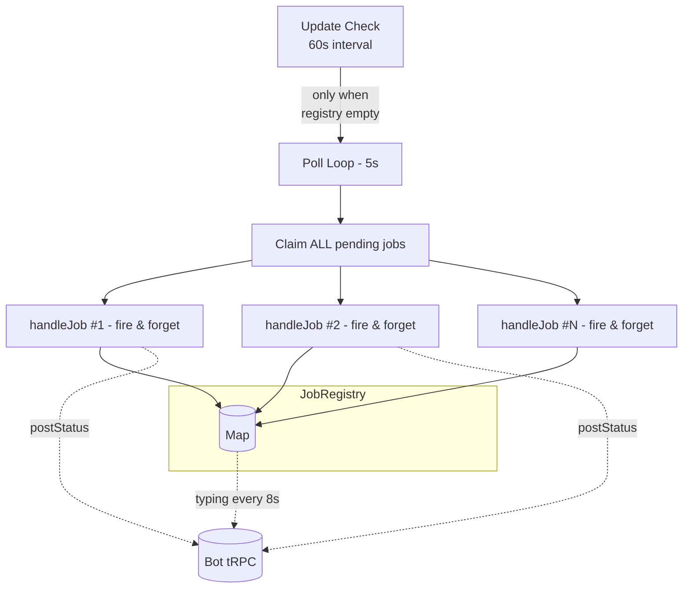

# Parallel Job Execution for Worker

## Goal

Make the worker run **all available jobs in parallel**, without any concurrency limit. The worker aggressively claims every pending job and runs each independently.

---

## Architecture



---

## Files to Change

### 1. `packages/shared/src/schemas.ts` — Change `PollNextJobOutput`

```diff
 PollNextJobOutput = z.object({
-  job: JobSchema.nullable(),
+  jobs: z.array(JobSchema),
   gitMismatch: z.boolean(),
 });
```

Also update `packages/shared/src/router.ts` stub to match.

---

### 2. `packages/bot/src/trpc/router.ts` — `pollNextJob` returns all pending

Return **every** pending job atomically instead of one:

```typescript
pollNextJob: t.procedure
  .input(PollNextJobInput)
  .output(PollNextJobOutput)
  .query(async ({ input }) => {
    // ... git HEAD check ...
    // ... worker heartbeat upsert ...

    const pending = await prisma.job.findMany({
      where: { status: "pending" },
      orderBy: { createdAt: "asc" },
    });

    const claimed: JobOutput[] = [];
    for (const job of pending) {
      const repo = await prisma.repository.findUnique({ where: { slug: job.repoSlug } });
      const updated = await prisma.job.update({
        where: { id: job.id, status: "pending" },
        data: { status: "claimed", workerId: input.workerId, repoPath: repo?.path ?? "" },
      });
      if (updated) {
        claimed.push(toJobOutput(updated));
        await postToThread(updated.threadId, `ℹ️ Worker **${input.workerId}** picked up the job`);
      }
    }

    return { jobs: claimed, gitMismatch: false };
  }),
```

---

### 3. `packages/worker/src/state.ts` — Rewrite to Job Registry

Replace module-level `_activeJobId` / `typingInterval` singletons with `Map<number, JobContext>`:

```typescript
interface JobContext {
  jobId: number;
  threadId: string;
  typingInterval: Timer | null;
  startedAt: number;
}

const jobs = new Map<number, JobContext>();

function registerJob(jobId: number, threadId: string): void {
  const ctx: JobContext = { jobId, threadId, typingInterval: null, startedAt: Date.now() };
  ctx.typingInterval = setInterval(() => {
    client.typing.mutate({ jobId, threadId }).catch(() => {});
  }, 8_000);
  client.typing.mutate({ jobId, threadId }).catch(() => {});
  jobs.set(jobId, ctx);
}

function unregisterJob(jobId: number): void {
  const ctx = jobs.get(jobId);
  if (ctx?.typingInterval) clearInterval(ctx.typingInterval);
  jobs.delete(jobId);
}

function isEmpty(): boolean {
  return jobs.size === 0;
}
```

---

### 4. `packages/worker/src/polling.ts` — Aggressive non-blocking poll

- **Remove** the `getActiveJobId() !== null` guard entirely
- Claim from the new batch `jobs` array instead of single `job`
- Launch each handler fire-and-forget

```typescript
async function poll(): Promise<void> {
  const localHead = Bun.spawnSync(["git", "rev-parse", "HEAD"]).stdout.toString().trim();
  const result = await client.pollNextJob.query({ workerId: WORKER_ID, gitHead: localHead });

  if (result.gitMismatch) {
    runUpdate();
    return;
  }

  for (const job of result.jobs ?? []) {
    workerLog(`Claimed job #${job.id} for repo ${job.repoSlug}`);
    registerJob(job.id, job.threadId);
    handleJob(job).finally(() => unregisterJob(job.id));
  }
}
```

`checkForUpdates` guard changes from `getActiveJobId() !== null` to `!isEmpty()`.

---

### 5. `packages/worker/src/handleJob.ts` — Remove singleton references

Remove these lines/imports:
- `import { setActiveJobId, startTyping, stopTyping } from "./state"` (or equivalent)
- `setActiveJobId(job.id)` — entry point (handled by `registerJob` in polling)
- `setActiveJobId(null)` — all cleanup sites (handled by `.finally()` in polling)
- `startTyping(...)` — (handled by `registerJob`)
- `stopTyping()` — all calls (handled by `unregisterJob`)

The handler stays structurally identical — just shorter.

---

### 6. `packages/worker/src/plan.ts` — Deterministic plan path, no `PLAN_PATH:` fallback

**Problem**: The prompt tells the agent to "save the plan file" without saying *where*. The agent writes inside the worktree, which gets destroyed by `gwq remove`. The worker then scans agent output for `PLAN_PATH:` to find the file.

**Fix**: Compute the path upfront, tell the agent exactly where to write, and read from that known path directly — no output scanning.

```diff
+import path from "node:path";
+
+// Deterministic path outside the worktree, relative to the project root
+const planDir = path.join(job.repoPath, ".opencode", "plans");
+const planFileName = `plan-${job.id}-${job.repoSlug.replace(/[^a-zA-Z0-9]/g, "-")}.md`;
+const planFilePath = path.join(planDir, planFileName);
+
 const prompt = [
   `You are a planning agent for a ${job.kind} task on repository ${job.repoSlug}.${issueRef}`,
   `Review the codebase and write a detailed implementation plan.`,
   `The plan will be displayed in a full-featured Markdown viewer that supports Mermaid diagrams, ...`,
   `The plan should cover: files to change, approach, and any risk areas.`,
-  `After saving the plan file, report the exact path where it was saved by writing a single line at the end of your response in this exact format: PLAN_PATH:/path/to/your/plan.md`,
+  `Write the plan to \`${planFilePath}\` (create the directory if it doesn't exist).`,
   contextBlock,
   helperBlock,
 ].filter(Boolean).join(" ");
```

Pass `planFilePath` to `runOpencodeStreaming` so it reads from there after the agent exits:

```diff
-return runOpencodeStreaming(job.id, worktreePath, [
+return runOpencodeStreaming(job.id, worktreePath, planFilePath, [
   "opencode", "run", "--agent", "plan", "--dir", worktreePath, prompt,
 ]);
```

---

### 7. `packages/worker/src/approval.ts` — Same deterministic path, no `PLAN_PATH:` fallback

**Problem**: Two issues — (1) the fallback prompt at line 91 targets `$HOME/.local/share/opencode/plans/` (wrong dir), (2) it uses the `PLAN_PATH:` output scanning pattern.

**Fix**: Compute the same `planFilePath` from `job.repoPath` and pass it through:

```typescript
// At top of waitForApproval or as shared helper:
const planDir = path.join(job.repoPath, ".opencode", "plans");
const planFileName = `plan-${job.id}-${job.repoSlug.replace(/[^a-zA-Z0-9]/g, "-")}.md`;
const planFilePath = path.join(planDir, planFileName);
```

**Fallback prompt** (line 91):
```diff
-`Write the plan to \`$HOME/.local/share/opencode/plans/\` ... PLAN_PATH:/path/to/your/plan.md`,
+`Write the plan to \`${planFilePath}\` (create the directory if it doesn't exist).`,
```

**Session resume path** (line 67): Pass `planFilePath` to `runOpencodeStreaming`:
```diff
 const result = await runOpencodeStreaming(
   jobId,
   worktreePath,
+  planFilePath,
   [ ...args ],
 );
```

**Fresh plan path** (line 108): Same change.

---

### 8. `packages/worker/src/opencode.ts` — Accept known `planFilePath`, remove output scanning

**Current behavior**: After agent exits, scans all text output for `PLAN_PATH:` marker. If found, reads plan from that path. Otherwise, falls back to concatenating text parts.

**New behavior**: Accept optional `planFilePath` parameter. When provided, read directly from that path after agent exits. No `PLAN_PATH:` scanning, no text concatenation fallback.

```diff
 async function runOpencodeStreaming(
   jobId: number,
   cwd: string,
+  planFilePath?: string,
   argv: string[],
   extraArgs: string[] = [],
 ): Promise<{ planMd: string; sessionId: string }> {
   // ... spawn logic unchanged ...
   // ... streaming/event handling unchanged ...
   // ... sessionId extraction unchanged ...

-  let planMd: string;
-  if (planPath) {
-    jobLog(jobId, `Reading plan from reported path: ${planPath}`);
-    planMd = await Bun.file(planPath).text().catch(() => {
-      jobLog(jobId, `Failed to read plan from ${planPath}, falling back to text`);
-      return textParts.join("\n\n");
-    });
-  } else if (textParts.length > 0) {
-    jobLog(jobId, `No plan path reported, using ${textParts.length} text parts`);
-    planMd = textParts.join("\n\n");
-  } else {
-    jobLog(jobId, `No plan path or text content available`);
-    planMd = "";
-  }
+  // Read plan from deterministic path (no PLAN_PATH: output scanning)
+  let planMd = "";
+  if (planFilePath) {
+    await Bun.sleep(500); // brief grace period for file flush
+    const file = Bun.file(planFilePath);
+    const exists = await file.exists();
+    if (exists) {
+      planMd = await file.text();
+      jobLog(jobId, `Read plan from ${planFilePath} (${planMd.length} chars)`);
+    } else {
+      jobLog(jobId, `Plan file not found at ${planFilePath}`);
+    }
+  }
```

Remove the `planPath` variable and `extractPlanPath` call from the streaming loop (the `if (event.type === "text" && ...) { extractPlanPath(...) }` block). `textParts` is no longer needed for plan fallback, but keeping the text event processing for status streaming is fine.

---

### 9. `packages/worker/src/events.ts` — Remove `extractPlanPath`

```diff
-function extractPlanPath(text: string): string | null {
-  const match = text.match(/PLAN_PATH:(.+)/);
-  if (match?.[1]) return match[1].trim();
-  const altMatch = text.match(/The plan has been written to (.+)/);
-  if (altMatch?.[1]) return altMatch[1].trim();
-  return null;
-}
```

Remove the function and its export. Update `opencode.ts` to not import it.

---

### 10. `packages/worker/src/build.ts` — No plan path needed

Build agent doesn't produce a plan. Remove the `planMd` value from its `runOpencodeStreaming` call. Since `planFilePath` is optional, just don't pass it:

```diff
-await runOpencodeStreaming(jobId, worktreePath, [
+await runOpencodeStreaming(jobId, worktreePath, undefined, [
   "opencode", "run", "--agent", "build", "--dir", worktreePath, prompt,
 ]);
```

---

## Files Not Changed

| File | Reason |
|------|--------|
| `worker/src/env.ts` | No new env vars needed |
| `worker/src/worktree.ts` | No changes needed |
| `worker/src/issue.ts` | No changes needed |
| `worker/src/exec.ts` | No changes needed |
| `worker/src/index.ts` | Already delegates to polling; no state imports |
| `bot/prisma/schema.prisma` | No schema changes |
| `bot/src/discord/*` | No Discord changes needed |

---

## Risk Areas

| Risk | Severity | Mitigation |
|------|----------|------------|
| **CPU contention** (N opencode instances) | Medium | Acceptable on dev laptop; user controls volume |
| **RAM** (model per instance) | Medium | Practical limit ~3-5 jobs on 16GB machine |
| **Worktree disk usage** | Low | `gwq` worktrees are lightweight |
| **Discord rate limits** (50 req/s) | Low | Parallel typing at 8s intervals stays under limit |
| **Plan file persistence** | ✅ Fixed | Saved at `{repoPath}/.opencode/plans/` — outside worktree, survives cleanup |

---

## Plan File Location Summary

| Aspect | Before | After |
|--------|--------|-------|
| **Directory** | Worktree root (implicit) | `{repoPath}/.opencode/plans/` |
| **File name** | `PLAN.md` (default) | `plan-{jobId}-{repoSlug}.md` |
| **Survives worktree cleanup?** | ❌ (deleted with worktree) | ✅ (outside worktree) |
| **How worker reads plan** | Scans output for `PLAN_PATH:` | Reads from known deterministic path |
| **Fallback if file missing** | Concatenates text parts | Returns empty string (logged) |

---

## Implementation Order

1. `packages/shared/src/schemas.ts` — `PollNextJobOutput.job` → `jobs: z.array(...)`
2. `packages/bot/src/trpc/router.ts` — Return all pending jobs
3. `packages/worker/src/state.ts` — Map-based registry
4. `packages/worker/src/polling.ts` — Batch claim + fire-and-forget
5. `packages/worker/src/handleJob.ts` — Remove singleton imports/calls
6. `packages/worker/src/opencode.ts` — Accept `planFilePath`, remove `PLAN_PATH:` scanning
7. `packages/worker/src/events.ts` — Remove `extractPlanPath`
8. `packages/worker/src/plan.ts` — Add deterministic plan path
9. `packages/worker/src/approval.ts` — Consistent deterministic path
10. `packages/worker/src/build.ts` — Pass `undefined` for plan path
11. `bun run typecheck`
12. Manual test
