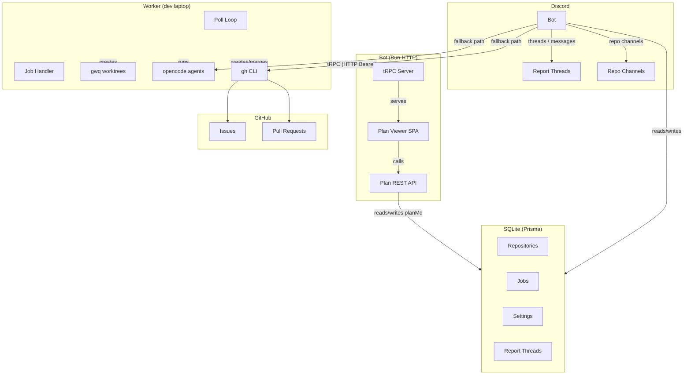

# opencode-discord

A Discord bot that turns slash commands into AI-powered PRs. Users file bug reports, feature requests, or tasks via Discord, and a worker processes them with opencode (plan + build agents) to produce GitHub pull requests. Includes a web-based plan viewer/editor SPA.

## Architecture



Key flows:

- **Poll loop:** Worker → `pollNextJob` → claims pending jobs
- **Job pipeline:** claim → issue → plan → approval → build → PR
- **Status updates:** Worker → `postStatus` → Discord thread
- **Plan viewer:** User opens `BOT_URL/plan-viewer/?jobId=N&token=...` → edits plan → saves via PUT → approves via POST
- **Fallback path:** Bot runs opencode + gh when no worker is online (no heartbeat within 60s)
- **Stale-job sweep:** Bot releases jobs from workers with no heartbeat > 2 min (every 60s)
- **Auto-merge check:** Bot polls `gh pr view` for merged PRs → auto-closes thread

Three packages in a Bun workspace:

| Package | Entrypoint | Key Contents |
|---------|------------|-------------|
| `packages/shared` | `src/index.ts` | Zod schemas, types, stub tRPC router (for type safety only) |
| `packages/bot` | `src/index.ts` | Discord.js client, Prisma/SQLite, tRPC server (real router), plan-viewer SPA (`public/plan-viewer/`) |
| `packages/worker` | `src/index.ts` | Poll loop, `gwq`/`opencode`/`gh` orchestration, job pipeline (5 steps) |

## Prerequisites

- **Bun** ≥ 1.2
- **Discord bot** with `applications.commands` scope and Gateway Intents: `Guilds`, `GuildMessages`, `MessageContent`
- **gwq** installed and on PATH (git worktree manager)
- **opencode** installed and on PATH
- **gh** (GitHub CLI) authenticated
- **oxlint** (optional, for pre-commit linting)
- A repository directory with a checked-out git repo (the worker does **not** clone)
- **Discord "Repositories" category** — auto-created on startup, one text channel per repo

## Setup

```bash
# 1. Install dependencies
bun install

# 2. Create bot environment (copy root .env.example)
cp .env.example packages/bot/.env
# Edit packages/bot/.env with your values

# 3. Generate Prisma client & run initial migration
cd packages/bot
bunx --bun prisma generate
bunx --bun prisma migrate dev --name init
cd ../..

# 4. Deploy slash commands (requires CLIENT_ID in .env)
bun run bot-deploy
```

**Important:** Always use `prisma migrate dev` for schema changes, never `prisma db push`. Run all Prisma commands from `packages/bot/` where `prisma.config.ts` picks up `DATABASE_URL` from `.env`.

## Environment Variables

### Bot (`packages/bot/.env`)

| Variable | Required | Default | Description |
|----------|----------|---------|-------------|
| `DISCORD_TOKEN` | ✅ | — | Discord bot token |
| `CLIENT_ID` | ✅ (for deploy) | — | Discord application client ID |
| `SHARED_SECRET` | ✅ | — | Shared secret for tRPC auth (must match worker) |
| `DATABASE_URL` | ✅ | `file:./dev.db` | SQLite DB path |
| `TRPC_PORT` | — | `3000` | tRPC HTTP server port |
| `ALLOWED_GUILD_ID` | — | — | Restrict bot to this guild only |
| `ALLOWED_USER_ID` | — | — | Restrict bot to this user only |
| `GH_TOKEN` | — | — | GitHub PAT for bot account (used by fallback path) |
| `GIT_BOT_NAME` | — | `opencode-bot` | Git commit author name (for fallback) |
| `GIT_BOT_EMAIL` | — | `opencode-bot@users.noreply.github.com` | Git commit author email |

### Worker (shell env or `packages/worker/.env`)

| Variable | Required | Default | Description |
|----------|----------|---------|-------------|
| `SHARED_SECRET` | ✅ | — | Must match bot's shared secret |
| `WORKER_ID` | — | `default` | Worker identity (e.g. `my-laptop`) |
| `BOT_URL` | — | `http://localhost:3000` | Bot's tRPC endpoint |
| `DRY_RUN` | — | `false` | Skip `gwq`/`opencode`/`gh` execution, log only |
| `SKIP_PERMISSIONS` | — | `true` | Pass `--dangerously-skip-permissions` to opencode |
| `GH_TOKEN` | — | — | GitHub PAT for worker operations |
| `GIT_BOT_NAME` | — | `opencode-bot` | Git commit author name |
| `GIT_BOT_EMAIL` | — | `opencode-bot@users.noreply.github.com` | Git commit author email |
| `GIT_COAUTHOR_NAME` | — | — | Your name (for `Co-authored-by` trailer) |
| `GIT_COAUTHOR_EMAIL` | — | — | Your GitHub email (for `Co-authored-by` trailer) |

> **No model env variables** — the issue model, fallback model, auto-mode, quick-mode, and verbose-mode are stored in the database `Setting` table, not env variables.

## Running

```bash
# ── Bot ───────────────────────────────────────────────────────
bun run dev:bot            # watch mode
# or: bun run --cwd packages/bot dev

# ── Worker ─────────────────────────────────────────────────────
bun run dev:worker         # watch mode
# or: SHARED_SECRET="..." WORKER_ID="my-laptop" bun run --cwd packages/worker dev

# ── Worker daemon (restart loop) ───────────────────────────────
./run-worker.sh            # foreground with restart loop
./run-worker.sh --daemon   # background via nohup
./run-worker.sh stop       # stop daemon

# ── Deploy slash commands ─────────────────────────────────────
bun run bot-deploy         # requires CLIENT_ID in .env
```

## Discord Commands

| Command | Description |
|---------|-------------|
| `/repo add <slug> <path> [origin-url]` | Register a repository (first becomes default, creates Discord channel) |
| `/repo remove <slug>` | Remove a repository record (deletes Discord channel, prevents if active jobs) |
| `/repo list` | List all registered repositories (default marked with ⭐) |
| `/repo set-default <slug>` | Change the default repository |
| `/repo sync-channels` | Create missing Discord channels for all registered repos |
| `/create-report <kind> [repo]` | Create a private report thread (uses repo-specific channel if bound, else creates in current channel) |
| `/submit [auto] [quick]` | Submit thread as a job (collects messages as context, offers follow-up continuation) |
| `/resolve <issue> [auto] [quick]` | Create a fix job from a GitHub issue URL or short description |
| `/review <pr_url> [auto] [quick]` | Review a GitHub PR, fix issues, and merge (creates thread or uses current) |
| `/review-merge` | Run review agent on the PR from the last completed job in this thread |
| `/close` | Close and archive the current report thread (cancels active jobs) |
| `/update` | Pull latest code via git, run migrations, restart bot |
| `/clear-session` | Delete all bot messages in the current thread |
| `/help` | Show categorized list of all commands |
| `/jobs [repo] [status] [limit]` | List recent jobs with optional filters (emoji per status) |
| `/settings view` | View all current bot settings |
| `/settings model <name>` | Set the issue generation model |
| `/settings fallback-model <name>` | Set the fallback model |
| `/set-auto <mode>` | Set global auto-approve mode (on/off) |
| `/set-quick <mode>` | Set global quick mode (on/off — skip planning, build directly) |
| `/set-verbose <mode>` | Toggle verbose status reporting (on/off) |

## Job Flow

```mermaid
flowchart TD
    CR["/create-report"] --> T[Private report thread created]
    T --> SUB[/submit or /resolve\]
    SUB --> J[Job created: status=pending]
    J --> WO{Worker online?}

    WO -->|No| FALLBACK[Fallback path]
    WO -->|Yes| CLAIM[Worker claims job: status=claimed]

    CLAIM --> WT[gwq add -b report-N : create worktree]
    WT --> ISSUE[opencode run --model <issue_model> : generate GitHub issue]
    ISSUE --> RENAME[Rename thread to #N title]

    RENAME --> QM{quickMode?}
    QM -->|Yes| BUILD[Build agent]
    QM -->|No| PLAN[opencode run --agent plan : write PLAN.md]

    PLAN --> POST[Post plan to thread + plan-viewer URL]
    POST --> APPROVAL{Approval loop}

    APPROVAL -->|Approve (button)| BUILD
    APPROVAL -->|Auto-approve (10s countdown)| BUILD
    APPROVAL -->|Suggest changes| SUGGEST["opencode --session --continue : revise plan"]
    SUGGEST --> POST

    subgraph AGENT_FLOW[Agent Question Flow]
        PLAN --> ASK{Agent has questions?}
        ASK -->|Yes| Q_SHOW[Show questions in thread via Discord buttons + text input]
        Q_SHOW --> Q_ANS[User answers]
        Q_ANS --> Q_INJECT["opencode --session --continue with Q&A"]
        Q_INJECT --> PLAN
        ASK -->|No| POST
    end

    BUILD --> PR["gh pr create : PR URL"]
    PR --> DONE["status=done, Review & Merge button"]
    DONE --> RM[/review-merge or button\]
    RM --> RM_JOB[Review-merge job created]

    subgraph REVIEW_MERGE[Review & Merge Pipeline]
        RM_JOB --> CHECKOUT[Fetch PR branch + reset to base]
        CHECKOUT --> REVIEW[opencode --agent 'PR review merge' : review loop]
        REVIEW -->|Clean| MERGE[gh pr merge --auto --squash / --squash]
        REVIEW -->|Issues found| FIX[opencode run --agent build : fix issues]
        FIX --> REVIEW
        MERGE --> CLOSE[Thread closed + archived]
    end

    subgraph STALE[Background Tasks - Bot 60s interval]
        SWEEP[Release jobs from workers with heartbeat > 2 min stale]
        AMC[Check merged PRs via gh pr view → auto-close thread]
    end

    subgraph FALLBACK_PATH[Fallback Path]
        FALLBACK --> CLONE[Clone repo to temp dir]
        CLONE --> GEN_ISSUE[opencode run --model <fallback_model> : generate issue]
        GEN_ISSUE --> GH_CREATE[gh issue create]
        GH_CREATE --> GH_COMMENT[gh issue comment with /opencode fix]
        GH_COMMENT --> FALLBACK_DONE[status=done]
    end
```

### Fallback path (no worker online)

1. Bot clones the repo to a temp directory
2. Bot runs `opencode run --model <fallback_model>` to generate an issue title + body
3. Bot runs `gh issue create` and posts the issue URL to the thread
4. Bot runs `gh issue comment` with `/opencode fix this issue in a PR`
5. Job marked done

## Database Settings

These settings are stored in the `Setting` table and can be changed via Discord commands:

| Key | Default | Description | Changed via |
|-----|---------|-------------|-------------|
| `auto_mode` | `off` | Global auto-approve mode | `/set-auto` |
| `quick_mode` | `off` | Skip planning, build directly | `/set-quick` |
| `verbose_mode` | `on` | Suppress info-level status messages | `/set-verbose` |
| `issue_model` | `opencode/big-pickle` | Model for worker issue generation | `/settings model` |
| `fallback_model` | `opencode/big-pickle` | Model for fallback path (no worker) | `/settings fallback-model` |
| `worker:<id>:lastSeen` | — | Heartbeat timestamp (auto-set) | — |

## Design Notes

- **No database access in worker** — all state flows through tRPC
- **Repo path resolved at claim time** — stored on the job record, never re-queried
- **Removal is record-only (plus channel deletion)** — `/repo remove` deletes the Discord channel but never touches the filesystem
- **No env variables for models or modes** — everything stored in `Setting` table
- **Single job per worker** — poll loop is intentionally single-tenant
- **Auto-mode** — plans auto-approve after a 10-second cancellable countdown
- **Quick-mode** — skips the plan agent entirely, goes straight to build
- **Verbose mode** — defaults to on; set to off to suppress info-level status messages
- **Suggest-changes loop** — worker polls via `getJobStatus` for `pendingSuggestion`, resumes opencode with `--session --continue`, re-posts the updated plan
- **Question flow** — opencode plan agent can ask multiple-choice questions; answers are injected via `--session --continue`
- **Plan viewer** — web-based plan editor at `/plan-viewer/?jobId=N&token=T`; supports view, edit, and approve with an embedded token for auth
- **Stale-job recovery** — bot sweeps every 60s: releases jobs from workers with heartbeat > 2 min stale
- **Auto-merge check** — bot polls `gh pr view` for merged PRs every 60s; auto-closes thread on merge
- **Repo channels** — each registered repo gets a Discord text channel; `/create-report` in a repo channel auto-binds to that repo; `sync-channels` creates missing channels under a "Repositories" category
- **Follow-up jobs** — `/submit` in a thread with a completed job offers to continue the previous session
- **Review & Merge** — standalone `/review` command or button from a completed PR job; runs review-fix loop (max 3 iterations) then squash-merges
- **Update command** — `/update` runs `git pull`, `bun install`, `prisma migrate deploy`, then restarts; worker auto-updates on next heartbeat via git HEAD exchange
- **Graceful shutdown** — releases all in-flight jobs back to `pending` on SIGTERM/SIGINT
- **Presence indicator** — bot shows "Worker online" / "Worker offline" based on heartbeat (checked every 30s)
